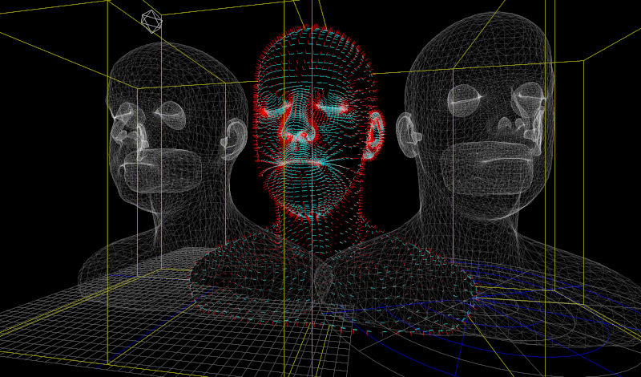

## Fundamentals of 3D animation for the web


The goal of the course is to give students the tools to create a video-game, an open space or a 3D animation that runs in the browser, can be self-hosted without the need of a social media platform, and can be shared with a link. Each student will develop its own game/animation, with the only constrain to create a link to the game/animation of another classmate.

We will only use open source tools such as Three.js and Blender. 

The course is aimed at beginners, some familiarity with variables, loops and arrays is recommended but not mandatory.



*Image from the three.js website*


### 01

- Examples of 3D in the browser
- The theater example
- Offline rendering VS realtime rendering. The Monitor and the HZ
- How is the course structured
- How is the code structured


### 02

- Add light. Add more lights.
- Intro to exadecimal colors.
- Intro to transformation.
- Move things with sin(time) and cos(time) and the property `position`. Unit Circle, wave, amplitude and frequence.
- Check the [documentation](https://threejs.org/docs/#api/en/core/Object3D) for `scale`, `rotation`, apply the cos(time) or sine(time) to those two properties.
- Intro to matrices order multiplication.
- Exercise in class. Take inspiration from one the abstract art of the beginning of the '900 and try to make a 3D composition.
- Exercise in class. Use the function `camera.lookAt(mesh.position)` to have the camera always following an object.
- Install [node.js LTS](https://nodejs.org/en/). Close your terminal (called Command Prompt on Windows) and open it again. Write in the terminal the command 'node -v'. You can open a small window with a terminal directly into Visual Studio Code by pressing 'CTRL + J'(Win) or 'CMD + J' (Mac). Download the folder `02`. `cd` into that folder, run `npm install`.


### 03
- Moving things around. Animations that are not bounded to the frame rate. Why is that important?
- Getting mouse events.
- Exercise:Can you map the position of your mouse in the screen from -1 to +1 ?
- Exercise: Which other event can you log? (https://www.w3schools.com/jsref/met_document_addeventlistener.asp)

```
let time = Date.now()

const tick = () =>
{
    const currentTime = Date.now()
    const deltaTime = currentTime - time
    time = currentTime

    // Update objects
    mesh.position.y += 0.05 * deltaTime
}
```

- Intro to the scene Graph.
- Exercise. Use `Group` to group objects and move them.

```
const group = new THREE.Group()
group.scale.x = 3
group.rotation.x = 0.8
scene.add(group)
```

###


## Documentation

- [threejs docs](https://threejs.org/manual/#en/fundamentals)
- [making a game in threejs](https://threejs.org/manual/#en/game)
- [Class Notes](https://write.udk-berlin.de/p/Fundamentals_of_3D_animation_for_the_web)

#### Working with the terminal.

The navigation commands that you need to move around in your directories using the terminal are:

- `pwd`. It means "print working directory" and it simply print on screen the path on which you are at the moment.
- `ls`. It means "list", it lists all the files and directory in the folder where you currently are.
- `cd`, followed by the name of the folder you want to open. It means "change directory", and it is the equivalent of double clicking on a folder.
- `cd ..`. It means move back of one level

#### NPM
 - `npm install`. Install all the dependencies listed in `package.json`
 - `npm run dev`. Run a server
 - `npm run build`. Pack all our sources into static
